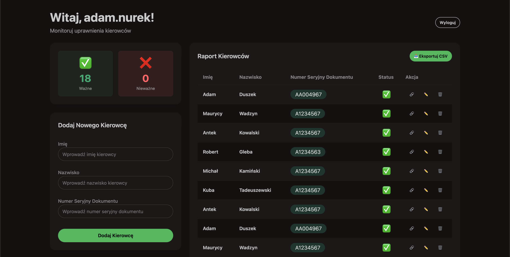

# sprawdzaniekierowcow.pl


---



### O Projekcie

**sprawdzaniekierowcow.pl** to darmowa aplikacja webowa do monitorowania ważności uprawnień kierowców. System umożliwia firmom transportowym, flotom pojazdów i pracodawcom bieżące śledzenie statusu praw jazdy swoich pracowników.

Informacje o uprawnieniach kierowców są publicznie dostępne w polskich rejestrach, jednak sprawdzanie ich ręcznie jest czasochłonne. Nasza aplikacja automatyzuje ten proces, pozwalając na:
- Szybkie dodawanie i importowanie danych kierowców
- Automatyczne sprawdzanie statusu uprawnień
- Monitoring ważności dokumentów
- Otrzymywanie powiadomień o zmianach statusu (odebranie, wygaśnięcie uprawnień)

Projekt został udostępniony jako open source z kilku kluczowych powodów:

### Funkcje


- 📊 **Dane w czasie rzeczywistym** - Dashboard z podsumowaniem statusu uprawnień
- 📥 **Import masowy** - Importuj dane wielu kierowców jednocześnie
- 🔐 **Bezpieczna autentykacja** - System rejestracji i logowania z weryfikacją email
- 🔔 **Powiadomienia** - Alerty o zmianach statusu uprawnień
### Stack Technologiczny


#### Wymagania

- Node.js 18+ lub Bun
- MySQL 8+
- Docker (opcjonalnie)

#### Kroki instalacji

1. **Sklonuj repozytorium**
```bash
git clone https://github.com/yourusername/sprawdzaniekierowcow.pl.git
cd sprawdzaniekierowcow.pl/app
```

2. **Zainstaluj zależności**
```bash
npm install
# lub
bun install
```

3. **Skonfiguruj bazę danych**

Opcja A - Użyj Docker:
```bash
npm run db:start
```

Opcja B - Użyj własnej instancji MySQL i utwórz bazę danych:
```sql
CREATE DATABASE sprawdzaniekierowcow;
```

4. **Skonfiguruj zmienne środowiskowe**

Utwórz plik `.env` w katalogu `app/`:
```env
DB_HOST=localhost
DB_NAME=sprawdzaniekierowcow
DB_USERNAME=root
DB_PASSWORD=your-password
SMTP_HOST=smtp.example.com
SMTP_PORT=587
SMTP_USER=your-email@example.com
SMTP_PASSWORD=your-password
SMTP_FROM=noreply@sprawdzaniekierowcow.pl
```

5. **Uruchom migracje bazy danych**
```bash
npm run db:push
```

6. **Uruchom aplikację w trybie deweloperskim**
```bash
npm run dev
```

Aplikacja będzie dostępna pod adresem `http://localhost:5173`

### Budowanie dla produkcji

```bash
npm run build
npm run preview
```

### Dostępne komendy

```bash
npm run dev          # Uruchom serwer deweloperski
npm run build        # Zbuduj aplikację
npm run preview      # Podgląd wersji produkcyjnej
npm run db:start     # Uruchom bazę danych (Docker)
npm run db:push      # Zastosuj zmiany w schemacie
npm run db:studio    # Otwórz Drizzle Studio
npm run lint         # Sprawdź kod
npm run format       # Formatuj kod
```

### Kontrybuowanie

Zapraszamy do współpracy! Jeśli chcesz pomóc w rozwoju projektu:

1. Fork repozytorium
2. Stwórz branch dla swojej funkcjonalności (`git checkout -b feature/AmazingFeature`)
3. Commit zmiany (`git commit -m 'Add some AmazingFeature'`)
4. Push do brancha (`git push origin feature/AmazingFeature`)
5. Otwórz Pull Request

#### Zasady kontrybuowania

- Przestrzegaj istniejącego stylu kodu (użyj `npm run lint` i `npm run format`)
- Dodaj testy dla nowych funkcji
- Zaktualizuj dokumentację jeśli to konieczne
- Upewnij się, że wszystkie testy przechodzą przed utworzeniem PR

### Zgłaszanie błędów

Znalazłeś błąd? Otwórz issue na GitHubie z następującymi informacjami:
- Opis problemu
- Kroki do reprodukcji
- Oczekiwane zachowanie
- Screenshots (jeśli dotyczy)
- Informacje o środowisku (przeglądarka, system operacyjny)

